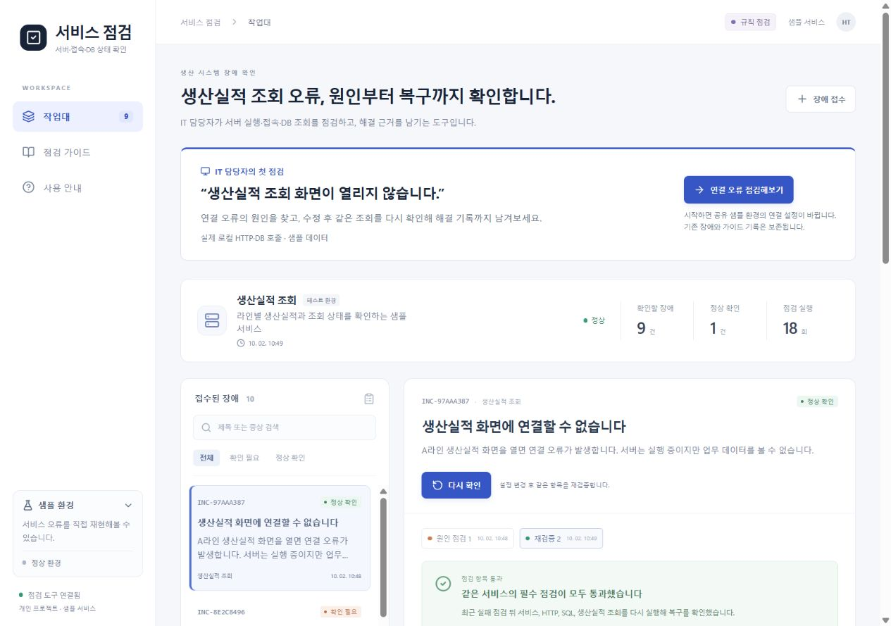
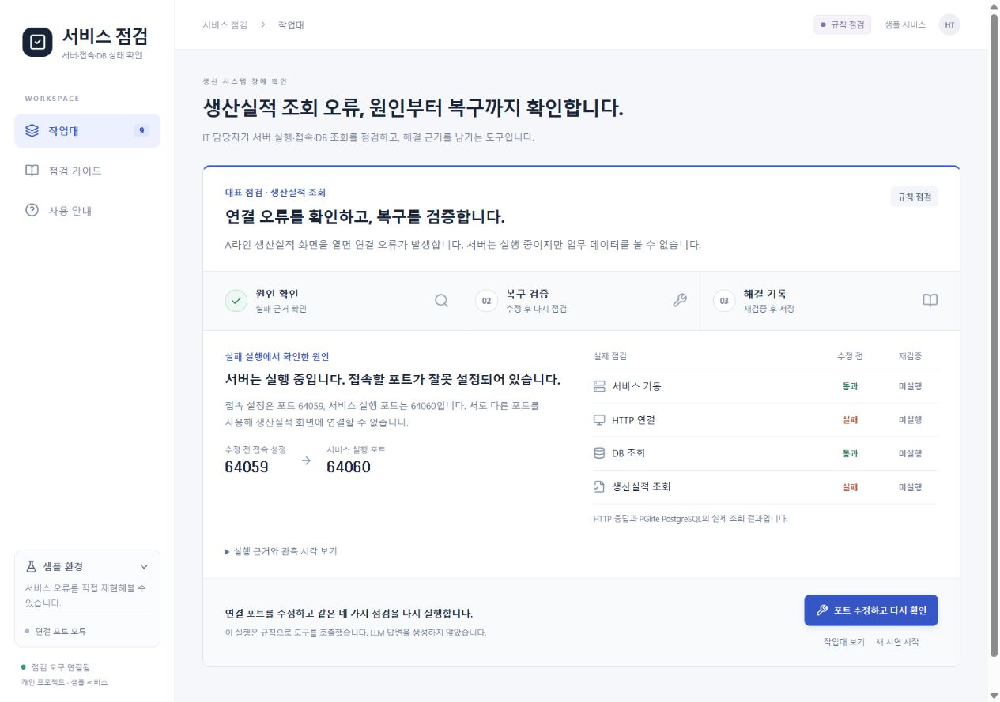
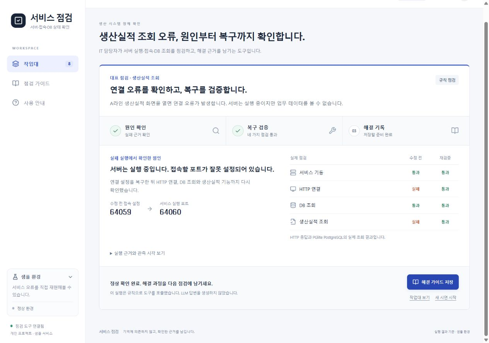
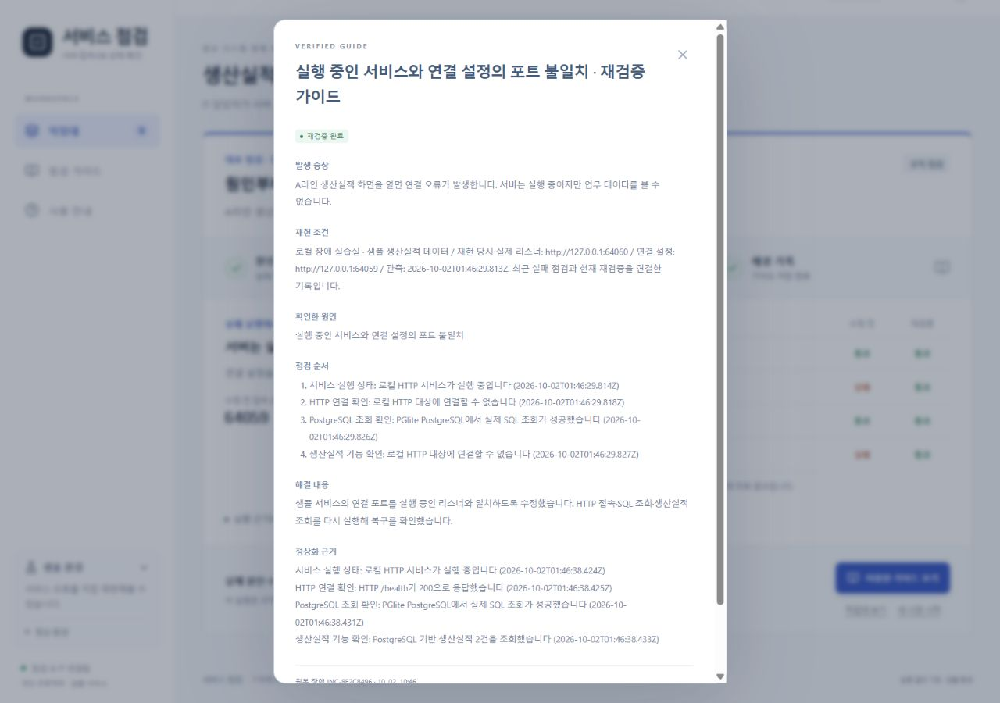
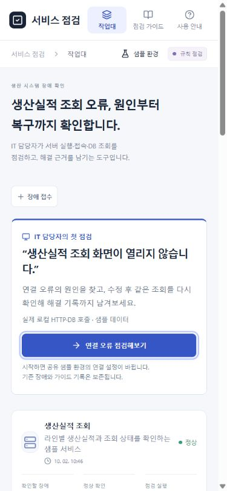
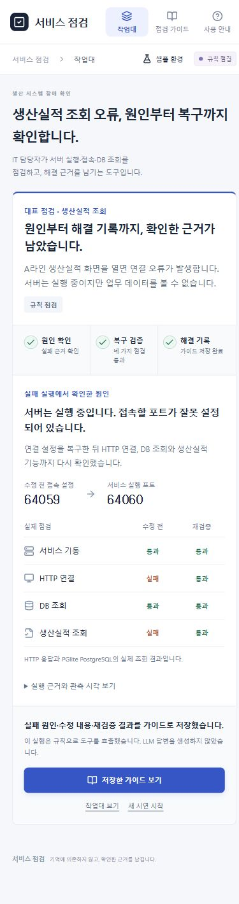
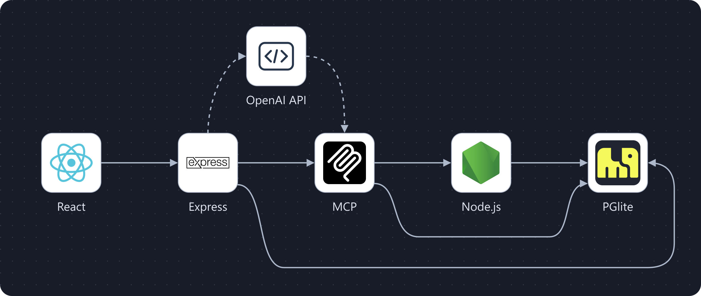
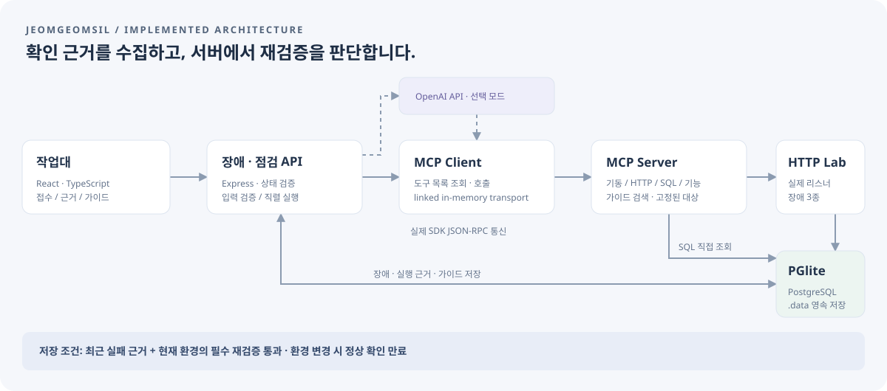

# 서비스 점검

**생산실적 조회가 안 될 때, 어디서 막혔는지 확인하고 복구 근거를 남기는 웹 앱입니다.**

IT 담당자가 “생산실적 화면에 연결할 수 없다”는 신고를 받은 상황을 다뤘습니다. 서버 실행, HTTP 접속, DB 조회, 실제 업무 기능을 차례로 확인합니다. 서버가 켜져 있어도 업무 조회가 실패하면 해결로 처리하지 않습니다.

`React · TypeScript · Node.js · Express · PostgreSQL(PGlite) · MCP`

[직접 실행](#3분-안에-직접-확인하기) · [시연 설명](docs/demo.md) · [검증 기록](docs/validation.md) · [API 문서](docs/api.md) · [직무 연결 근거](docs/job-fit.md)



*첫 화면에서 사용 대상과 확인 항목을 설명하고, 연결 오류를 직접 재현하는 시연으로 안내합니다.*

## 화면으로 보는 대표 시연

1. **연결 오류 점검해보기** — 새 장애를 접수하고 포트 오류를 재현합니다. 실제 MCP 도구로 서버·HTTP·SQL·생산실적을 확인합니다.
2. **포트 수정하고 다시 확인** — 로컬 연결 설정을 복구하고 같은 네 항목을 다시 실행합니다.
3. **해결 가이드 저장** — 실패 원인, 수정 내용, 복구 후 근거를 연결해 저장합니다.

### 1. 조회 실패의 원인을 구분합니다

서버와 DB는 정상인데 HTTP 연결과 생산실적 조회만 실패합니다. 서비스 실행 포트와 연결 설정을 대조해 **잘못된 포트 설정**을 원인으로 표시합니다.



*서버가 켜져 있다는 결과만으로 정상이라고 판단하지 않습니다. 각 항목의 실제 결과가 원인 설명과 함께 보입니다.*

### 2. 설정을 고친 뒤 업무 조회까지 다시 확인합니다

**포트 수정하고 다시 확인**을 누르면 로컬 접속 설정을 복구하고 같은 네 항목을 다시 점검합니다. 화면에는 수정 전 실패와 수정 후 결과를 함께 남깁니다.



| 확인한 항목 | 수정 전 | 수정 후 |
| --- | --- | --- |
| 서비스 기동 | 통과 | 통과 |
| HTTP 연결 | 실패 | 통과 |
| DB 조회 | 통과 | 통과 |
| 생산실적 조회 | 실패 | 통과 |

이 표는 대표 포트 오류 시연의 실제 관측 결과입니다. 포트 번호는 실행할 때 정해지며 화면에 하드코딩하지 않았습니다.

### 3. 다음 담당자가 다시 쓸 수 있는 해결 기록을 남깁니다

**해결 가이드 저장**은 실패 원인·수정한 내용·복구 후 점검을 하나의 기록으로 연결합니다. 실패와 성공 실행 ID가 모두 연결되어, 어떤 근거로 해결됐다고 판단했는지 확인할 수 있습니다.



*가이드 저장은 최근 실패와 현재 환경의 네 필수 점검을 모두 통과한 재검증이 있을 때만 가능합니다.*

기존 기록을 지우지 않습니다. 공유 샘플 환경을 바꾸면 과거의 정상 확인은 만료될 수 있습니다. **작업대 보기**에서 전체 실행 이력을 확인할 수 있습니다. [실제 실행 원문](docs/demo-evidence.json).

### 작은 화면에서도 같은 흐름을 사용합니다



*모바일에서는 메뉴와 버튼을 위쪽에 배치하고, 점검 결과는 한 열로 읽을 수 있게 구성했습니다.*

<details>
<summary>모바일에서 원인 확인 → 복구 검증 → 해결 기록까지 완료한 전체 화면</summary>



</details>

모든 화면은 실행 중인 앱에서 직접 촬영했습니다. 샘플 장애와 데이터로 시연하며, 실제 고객 시스템의 화면이나 장애 기록을 사용하지 않았습니다.

## 이 프로젝트에서 중요하게 다룬 세 가지

- **증상과 원인을 분리했습니다.** 조회 실패가 서버 중지인지, 접속 주소 오류인지, DB 권한 문제인지 독립된 점검으로 구분합니다.
- **복구를 다시 검사했습니다.** 최근 실패 근거와 현재 환경의 네 필수 점검이 모두 통과한 재검증이 있어야 가이드를 저장합니다.
- **설명에 근거를 연결했습니다.** 실행 시각·도구 출력·실패 원인·수정 후 결과가 같은 장애 기록에 남습니다. 실제 점검 결과와 맞지 않는 LLM 분석은 확정 원인으로 저장하지 않습니다.

기본 시연은 **규칙 점검**이며 실제 로컬 HTTP·PGlite PostgreSQL·MCP 통신을 실행합니다. OpenAI 연동 코드는 구현했지만 **실제 외부 모델 호출은 아직 검증하지 않았습니다.** 샘플 데이터로 만든 개인 프로젝트이며 한솔PNS 고객 시스템과 연결된 앱은 아닙니다.

## 실제로 구현한 범위

- **웹 작업대:** 장애 접수·검색·상태 필터, 점검 이력, 실패 근거, 재검증 비교, 해결 내용 입력, 가이드 조회
- **REST API:** 입력 검증과 오류 응답, 장애·점검·가이드의 타입 계약, 환경 변경과 점검의 직렬 실행
- **MCP:** 공식 TypeScript SDK의 Client / Server와 linked in-memory transport로 도구 목록 조회 및 실제 호출
- **HTTP 실습실:** 로컬 리스너 중지, 잘못된 연결 포트, 정상 환경 복구. 고정된 로컬 대상만 점검
- **PostgreSQL:** PGlite로 SQL 실행 및 파일 영속 저장, FK·고유 제약, 매개변수 쿼리, 점검 이력 인덱스
- **LLM 연동:** 서버에서 OpenAI API 요청, 도구 호출 루프, JSON 응답 검증, 근거 ID·확인된 원인 검증, 호출 한도와 타임아웃
- **검증:** 장애 3종, 재검증·가이드 저장 조건, 재시작, 동시 실행, 잘못된 입력·도구·AI 응답에 대한 자동 테스트

DB 연결 권한 오류는 **모의 애플리케이션 권한 게이트**입니다. PostgreSQL의 네이티브 인증 실패를 재현한 것으로 설명하지 않습니다. 정상 경로에서는 실제 PostgreSQL 쿼리와 업무 데이터 조회를 실행합니다.

## 구조와 판단 기준



**실선은 실제 로컬 점검·저장 경로, 위 점선은 선택 OpenAI API 경로입니다.** Node.js 카드는 점검 대상 HTTP 샘플 서비스, PGlite는 임베디드 PostgreSQL입니다. API와 MCP Client·Server도 같은 Node.js 프로세스에서 실행합니다. 모델이 도구를 선택하면 서버가 MCP로 실행하며, **실제 외부 모델 호출은 아직 미검증**입니다. OpenAI API 카드는 일반 API 아이콘을 사용했습니다.

React 화면이 Express API에 점검을 요청합니다. 서버는 MCP Client를 통해 점검 도구를 호출하고, 도구는 로컬 HTTP 서비스와 PGlite에서 근거를 수집합니다. 장애·실행 기록·가이드는 PGlite에 저장합니다. LLM 모드에서는 같은 도구를 모델이 추가 선택할 수 있으며, 실행 결과를 검증한 뒤 분석을 저장합니다.

<details>
<summary>상세 구조도 · 점검 대상과 저장 경로 보기</summary>



</details>

로고 출처·사용 범위와 화살표 설명은 [흐름도 근거](docs/diagrams/logo-sources.md)에 정리했습니다. [편집 가능한 SVG](docs/diagrams/technology-flow.svg)도 함께 제공합니다.

**해결 완료 판단은 서버가 맡습니다.** 최근 실패 근거가 있고, 현재 환경의 네 필수 점검이 모두 통과한 재검증이어야 합니다. 환경을 바꾸거나 서버를 다시 시작하면 현재 정상 확인은 만료됩니다. 이전 기록과 가이드는 과거 근거로 남습니다. 중간에 다른 원인이 확인되면 가장 최근 실패를 복구·가이드의 기준으로 사용합니다.

| MCP 도구        | 하는 일                                             |
| --------------- | --------------------------------------------------- |
| inspect_service | 실제 HTTP 리스너 실행 여부와 연결 주소 대조         |
| probe_http      | 설정된 로컬 대상의 /health 응답 확인                |
| probe_database  | 실제 매개변수 SQL 실행 또는 모의 권한 거부 확인     |
| read_production | HTTP /production을 통한 PostgreSQL 업무 데이터 조회 |
| search_guides   | 저장된 재검증 가이드 검색                           |

임의 URL, SQL, 셸 명령을 모델에 열어두지 않았습니다. MCP 통신은 같은 Node 프로세스 안에서 이루어지며, 외부 MCP 서버 배포나 원격 연동을 완료한 상태는 아닙니다.

## 한솔PNS 공고와 연결한 이유

한솔PNS의 공개 ITO 사업 설명에는 애플리케이션 유지보수와 서버·DB·네트워크 운영이 나옵니다. AI Atlas 공개 자료에서는 MES·QMS·PAM·ERP 등 업무 시스템과 AI의 연결을 설명합니다. 이 두 맥락에서 **기존 업무 서비스의 장애 확인을 웹 앱과 도구 호출로 묶는 프로젝트**를 선택했습니다. 공개 자료를 바탕으로 만든 개인 프로젝트이며, 한솔PNS의 실제 고객사 시스템이나 내부 기능을 복제한 것은 아닙니다. ([ITO](https://www.hansolpns.co.kr/itServiceIto.do), [AI Atlas](https://www.hansolpns.com/smartFactoryAi.do))

| 울산 풀스택 공고의 항목        | 프로젝트에서 보여주는 근거                           | 현재 한계                             |
| ------------------------------ | ---------------------------------------------------- | ------------------------------------- |
| Node.js / 서버 로직 / REST API | Express 서비스 계층, 검증된 요청·응답 계약           | 상용 운영 이력은 없음                 |
| DB 설계·SQL·쿼리 최적화        | 관계 제약, 매개변수 쿼리, 이력 인덱스와 EXPLAIN 실험 | 로컬·합성 데이터 실험                 |
| 사내 AI 앱·Agent·MCP           | 실제 MCP 통신과 도구 실행, LLM 도구 루프             | 외부 MCP 배포는 미구현                |
| 직접 LLM API 앱 개발 경험      | OpenAI 호출·오류 처리·출력 검증 코드                 | **실제 API 실행 증거 추가 필요**      |
| 서버 모니터링·장애 대응        | 기동·접속·SQL·업무 기능 점검과 복구 검증             | 주기 모니터링·운영 서버 연동은 미구현 |

공고 기준은 [한솔PNS 울산 풀스택 개발자 공식 공고](https://hansol.careerlink.kr/jobs/RC20260918034904)를 사용했습니다. 확인 기준일은 **2026-10-02**입니다. 우대사항인 클라우드 운영 경험을 이 로컬 앱으로 대신 주장하지 않습니다.

이 프로젝트의 출발점은 LS웨어 인턴에서 다뤘던 Linux TestBed의 설치·기동·접속·기능 확인, 실패 조건 분리, 재현 가능한 가이드 작성 경험입니다. 그 점검 방식을 이번 웹 앱의 흐름으로 옮겼습니다. 인턴 당시 AI 앱을 개발했다거나 고객 운영 장애를 처리했다는 주장과는 구분합니다. 자세한 경험 연결과 공개 출처는 [직무 연결 근거](docs/job-fit.md)에 정리했습니다.

## LLM API 모드 실행

1. .env.example을 **프로젝트 폴더의 .env**로 복사합니다.
2. OPENAI_API_KEY에 본인 키를 설정하고, OPENAI_MODEL에 접근 가능한 function calling 모델을 설정합니다. 기본값은 gpt-4.1-mini입니다.
3. 서버를 다시 시작하고 **사용 안내 → LLM API 점검으로 전환**을 누릅니다.
4. 장애 점검 후 실행 근거와 모드, 토큰 사용량을 확인합니다. 성공한 LLM 분석 응답의 사용량을 화면과 Run API의 usage에 저장합니다. 분석이 실패하면 사용량을 0으로 확정하지 않고 미확인으로 표시합니다.

키는 서버 설정으로만 사용하며, 브라우저 입력이나 응답에 포함하지 않습니다. LLM 모드는 증상과 샘플 점검 근거를 OpenAI로 보내며 API 사용 비용이 발생할 수 있습니다. 실제 고객정보·내부 문서·인증정보는 이 실습 앱에 넣지 않습니다.

실제 OpenAI 호출은 아직 검증하지 않았습니다. 현재 live 모드 테스트는 주입한 gateway로 도구 선택, 실제 MCP 실행, 잘못된 응답·허위 근거·호출 루프를 검증한 결과입니다. 실제 모델 실행을 확인할 때는 요청 시각·모델·토큰·진단 결과를 기록하되 키는 기록하지 않습니다. API 오류를 규칙 모드 성공으로 바꿔 표시하지 않습니다. ([OpenAI function calling](https://developers.openai.com/api/docs/guides/function-calling))


실제 호출의 실행 증거는 키를 설정한 뒤 **npm run evidence:llm**으로 확인할 수 있습니다. 독립 메모리 DB에서 포트 오류 → 복구 재검증 → 가이드까지 실행하고, 성공한 provider 응답의 요청 ID·모델·사용량과 실제 점검 결과를 docs/llm-evidence.json에 저장합니다. 총 API 요청은 최대 6회입니다. 키가 없으면 외부 요청과 결과 파일 생성을 하지 않으며, 실패 시 결과를 미확인으로 기록합니다. 현재는 키 미설정으로 호출하지 않았고 증거 JSON도 없습니다. 요청 ID 기록 기준은 [OpenAI API 공식 문서](https://developers.openai.com/api/reference/overview)를 참고했습니다.

## 3분 안에 직접 확인하기

Node.js 22.12 이상이 필요합니다. 개발·검증 환경은 Windows / Node.js 24입니다. Docker나 별도 PostgreSQL 설치 없이 실행합니다.

```bash
npm ci
npm run build
npm start
```

브라우저에서 [http://127.0.0.1:4310](http://127.0.0.1:4310)을 엽니다. Windows에서는 프로젝트 폴더의 **run.cmd**로도 실행할 수 있습니다.

첫 화면의 **연결 오류 점검해보기**로 대표 시연을 시작합니다. 직접 장애를 접수하려면 **장애 접수**, 다른 오류를 재현하려면 **샘플 환경**을 사용합니다.

처음부터 정상 상태라면 신고한 장애를 재현하지 못했다고 표시합니다. 점검 항목이 통과했다는 이유만으로 접수된 장애를 해결 완료로 바꾸지 않습니다.

## 실행·검증 명령

| 명령               | 결과                                                                       |
| ------------------ | -------------------------------------------------------------------------- |
| npm run check      | 타입 검사 → 자동 테스트 → 프론트 빌드                                      |
| npm run benchmark  | 실제 MCP 장애 3종 → 정상 재검증 → 가이드 저장, docs/smoke-report.json 생성 |
| npm run evidence:llm | 실제 OpenAI 실행 검증. 키 필요, 최대 6회 호출, 사용료 발생 가능 |
| npm run query-plan | 독립 메모리 DB의 합성 10,000건으로 인덱스 전후 실행계획 비교               |
| npm start          | 빌드된 화면과 API 실행, .data에 영속 저장                                  |
| npm run dev        | API 서버 실행                                                              |
| npx vite           | 별도 개발 화면 실행, /api는 4310 서버로 전달                               |

자동 테스트 **10/10 통과**. 실제 브라우저 사용 점검과 SQL 실험의 조건·결과는 [검증 기록](docs/validation.md), [장애 재현 결과](docs/smoke-report.json), [SQL 실행계획 원문](docs/query-plan.json)에 남겼습니다. 이 값은 운영 성능이나 토큰 절감률을 뜻하지 않습니다.

PGlite는 PostgreSQL을 WebAssembly로 실행하는 임베디드 DB입니다. 이 앱은 Node에서 사용하며 데이터는 .data에 저장합니다. 별도의 PostgreSQL 서버·네트워크 프로토콜·네이티브 사용자 인증을 검증한 프로젝트로 확대하지 않습니다. ([PGlite 공식 문서](https://pglite.dev/docs/))

API와 테이블 관계는 [API 문서](docs/api.md)에 정리했습니다.

## 파일을 읽는 순서

```text
src/App.tsx              접수·점검·가이드 화면
src/DemoJourney.tsx       원인 확인 → 복구 검증 → 해결 기록 시연
shared/contracts.ts      프론트와 서버의 타입 계약
server/incidents.ts      상태 판단, 직렬 실행, 가이드 조건
server/diagnostics.ts    MCP Client / Server 및 실제 도구
server/lab.ts            로컬 HTTP 장애 실습실
server/llm.ts            OpenAI 요청과 도구 루프, 출력 검증
server/storage.ts        PostgreSQL 스키마·쿼리·인덱스
tests/backend.test.ts    상태·근거·영속성·동시성 검증
scripts/llm-evidence.ts  실제 외부 모델 호출 증거 생성
docs/                    실제 화면, 직무 근거, 검증 기록
```

현재는 한 명이 로컬에서 사용하는 시연 앱입니다. 여러 사람이 실제 업무에 쓰려면 사용자 인증·권한, 가이드 개정 이력, 저장소 마이그레이션, 운영 대상별 연결 설정과 감사 기록을 추가해야 합니다.

AI 개발 도구의 도움을 받아 구현·검토했습니다. 화면과 도식은 이 프로젝트용으로 구성했고, 사용한 도구와 범위는 [개발 도구 검토](docs/tools-used.md)에 기록했습니다. 라이선스는 [MIT](LICENSE)입니다.
